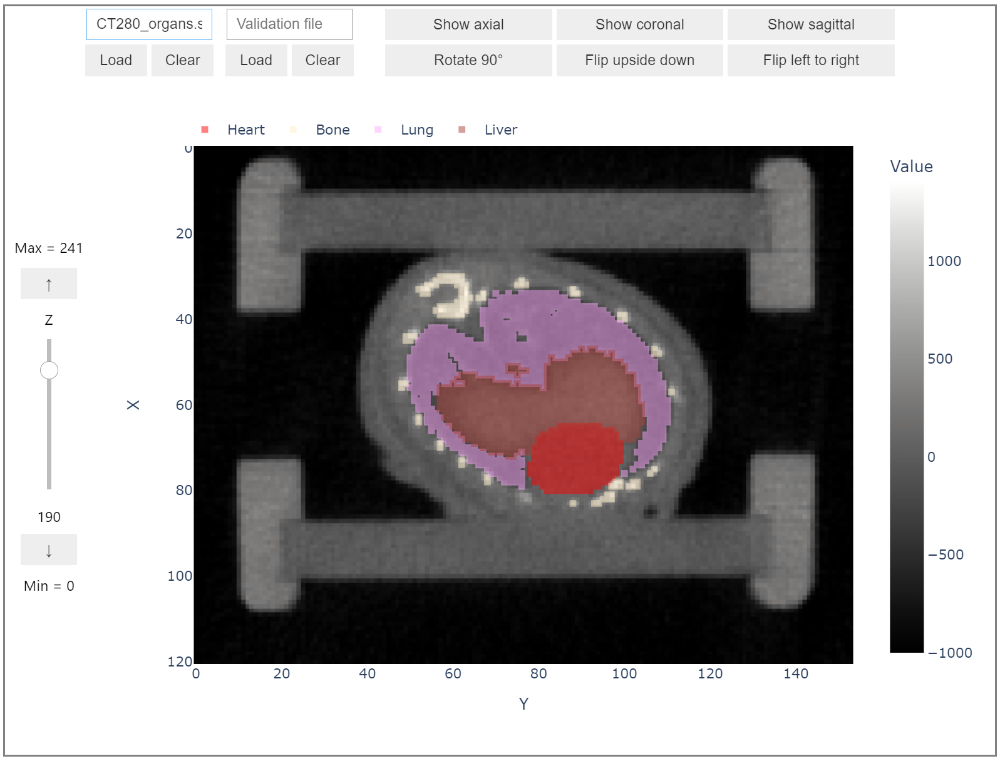

## slicevis
A Python package for interactive slice and segmentation visualization of 3D datasets in Jupyter notebooks.

 

Axial slice of murine CT scan with multi-class segmentation in *SliceWidget*.

# Installation (Windows)
1. Clone this repository `git clone https://git.rwth-aachen.de/nicholasbook/sce-project-ss22.git`.
2. (Optional) Create a virtual environment `py -m venv env` and activate it `call env/Scripts/activate.bat`.
3. Install locally using `pip install -e .`.

# Usage
*slicevis* is meant to be used in combination with Jupyter notebooks. I recommend that you use VSCode with the Python and Jupyter extension installed.
Check out the `examples` directory for test data and prepared notebooks.

Minimal usage:

```
from slicevis import SliceWidget
data = slicevis.load_image("CT280.gff") # 4D image
widget = slicevis.SliceWidget(data.get_timepoint())
```

# License
The *slicevis* package is licensed under the terms of the **MIT** license.

The examples directory of this repository contain data that is licensed under **CC-BY-SA 4.0**. Please refer to `examples/LICENSE.txt` for more details.

# Acknowledgements
The *slicevis* Python package was developed by me, Nicholas Book, as a final project for the course "Sustainable Computational Engineering", held by [Dr. Anil Yildiz](https://www.mbd.rwth-aachen.de/cms/mbd/Der-Lehrstuhl/Team/~qqcsz/Anil-Yildiz/) and [Dr. Hu Zhao](https://www.mbd.rwth-aachen.de/cms/mbd/Der-Lehrstuhl/Team/~qneki/Hu-Zhao/) of the [Chair of Methods for Model-based Development in Computational Engineering (MBD)](https://www.mbd.rwth-aachen.de/cms/~qamyz/mbd/). I would like to extend my gratitude to both for their kind support. 
